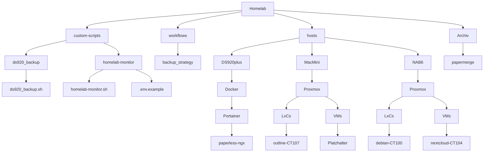

## Homelab

Willkommen in meinem HomeLab!  
Dieses Repository dokumentiert alle meine Maschinen, Container, VMs und benutzerdefinierten Skripte, inklusive Setup-Guides und Workflows. Ziel ist eine klare Struktur und einfache Wartung – auch wenn mal etwas Zeit zwischen den Projekten vergeht.

## Struktur



### Formatierungs Cheatsheet

> [!NOTE]
> Useful information that users should know, even when skimming content.

> [!TIP]
> Helpful advice for doing things better or more easily.

> [!IMPORTANT]
> Key information users need to know to achieve their goal.

> [!WARNING]
> Urgent info that needs immediate user attention to avoid problems.

> [!CAUTION]
> Advises about risks or negative outcomes of certain actions.

```
> [!NOTE]
> Useful information that users should know, even when skimming content.

> [!TIP]
> Helpful advice for doing things better or more easily.

> [!IMPORTANT]
> Key information users need to know to achieve their goal.

> [!WARNING]
> Urgent info that needs immediate user attention to avoid problems.

> [!CAUTION]
> Advises about risks or negative outcomes of certain actions.
```
