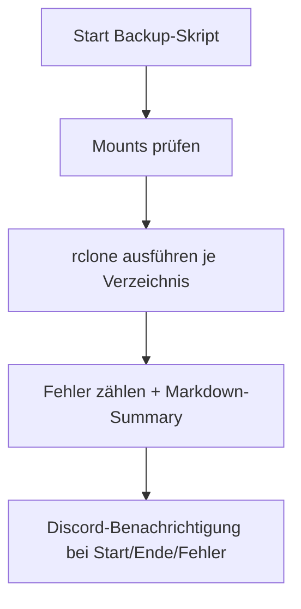

# 📦 DS920+ Backup-Skript

> ✅ Zentrales Backup-Skript zur Spiegelung wichtiger Verzeichnisse deiner Synology DS920+ auf das PR4100.
>
> - Unterstützt Discord-Benachrichtigungen
> - Enthält Watchdog gegen Inaktivität
> - Mit Logrotation und Status-Summary

Willkommen im Ordner `custom-scripts/ds920`. Dieses Skript wurde speziell für dein Homelab-Backup entwickelt und automatisiert die Sicherung via `rclone` vom NAS DS920+ auf das PR4100. Es nutzt zentrale Umgebungsvariablen aus einer `.env`-Datei und ist für manuelle oder automatisierte Ausführung optimiert.

---

## 🔄 Ziel des Skripts

Das Skript `ds920_backup.sh` sichert mehrere definierte Verzeichnisse auf deinem NAS.  
Die exakten Pfade werden über Umgebungsvariablen in der `.env`-Datei gesteuert.

---

## 📂 Ordnerstruktur

```bash
custom-scripts/ds920/
├── ds920_backup.sh     # Haupt-Backup-Skript
├── README.md           # Diese Anleitung
```

---

## ⚙️ Funktionsweise



---

## 🧾 Benötigte `.env`

Die `.env`-Datei definiert alle benötigten Variablen wie z. B.:

- den Discord Webhook für Benachrichtigungen (`DISCORD_WEBHOOK`)
- Quellpfade der Daten auf dem NAS (`MNT_*`)
- Zielpfade für das Backup (`MNT_BACKUP_TARGET`, `DST_*`)

Eine vollständige Vorlage findest du in `custom-scripts/.env.example`.

---

## 🚀 Ausführung

### Manuell starten:
```bash
bash ds920_backup.sh
```

Optional mit nur einem spezifischen Ordner:
```bash
bash ds920_backup.sh --only docker
```

Oder bestimmte Ordner überspringen:
```bash
bash ds920_backup.sh --skip nextcloud
```

---

## 📦 Logging & Watchdog

- Logs werden nach `/var/log/rclone-backups/` geschrieben
- Alte Logs werden nach 30 Tagen gelöscht
- Wenn das Skript länger als 5 Minuten inaktiv ist, wird abgebrochen
- Fehler werden gezählt und in der Discord-Zusammenfassung gemeldet

---

## 🔔 Discord-Integration

Es werden automatisch Nachrichten bei Start, Erfolg oder Fehlern gesendet. Beispiel:
```text
🛡️ **Backup gestartet** um: 2025-04-10 01:00:00
📁 Sicherung abgeschlossen in 12m 34s
❌ Fehler: 1 (z. B. Mount fehlgeschlagen)
```

---

## 🧠 Tipps

- Du kannst das Skript auch per zentralem Cronjob oder Discord-Bot triggern
- Nutze `--only` und `--skip` für selektive Backups
- Bei Problemen prüfe zuerst die Mounts und Logdateien

---

## 🛡️ Sicherheitshinweise

- Die `.env`-Datei niemals committen!
- Stattdessen ein `.env.example` nutzen
- `.gitignore` sollte beinhalten:
  ```bash
  *.env
  ```

---

## 📌 Nächste Ideen

- [ ] Parallelisierung der rclone-Jobs
- [ ] Unterstützung für differenzielle Backups
- [ ] Optionaler ZIP-Export der Logs für Audits

---

Fragen oder Anregungen?  
Meld dich wie immer direkt im Discord!
