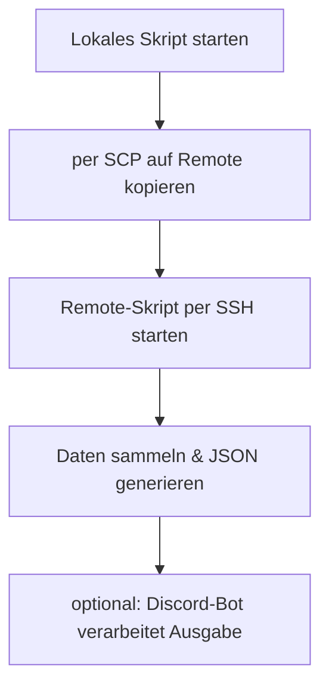

# Homelab Monitor

> ✅ TODO (nach Anonymisierung der zentralen Skripte und des Discord Bots):
>
> - [ ] `check_and_reboot.sh` und `check_ct_vm_memory.sh` verlinken + Abschnitt ⚙️ *Trigger durch zentrale Cronjobs* anpassen
> - [ ] Bot verlinken + Abschnitt 🤖 *Integration mit Discord Bot* neu schreiben lassen

Willkommen im Ordner `custom-scripts/homelab-monitor` deines HomeLab-Repositories. Dieses Setup stellt ein umfassendes, modular aufgebautes Monitoring-Skript bereit, das sowohl manuell als auch remote via SSH ausgeführt werden kann. Es ist speziell auf dein Homelab-Setup zugeschnitten (Proxmox + NAS + Discord Bot) und basiert auf zentral gepflegten Variablen in einer `.env`-Datei.

> [!NOTE]
> Dieses Skript ist vollständig modular aufgebaut und lässt sich durch zentrale Variablen in der `.env` flexibel anpassen.

---

## 📊 Ziel des Skripts

Das Skript `homelab-monitor.sh` sammelt systemrelevante Informationen von deinem Homelab-System – u. a. Uptime, CPU-Load, RAM, IP, Temperatur, Login-Historie, Backup-Status und mehr. Es erzeugt eine strukturierte JSON-Ausgabe, die optional auch vom Discord-Bot verwendet werden kann.

---

## 📂 Ordnerstruktur

```bash
custom-scripts/homelab-monitor/
├── homelab-monitor.sh   # Hauptskript
├── .env.example         # Beispiel für globale Umgebungsvariablen
```

> [!TIP]
> Die `.env.example` hilft dir dabei, schnell eigene Umgebungsvariablen anzulegen – einfach kopieren und anpassen.

---

## 🧾 Beispiel `.env`

Deine zentrale `.env` liegt unter:  
```bash
/opt/GitHub-Repo/custom-scripts/.env
```

Beispiel-Inhalt:

```env
# Allgemeine Settings
GITHUB_REPO="/opt/GitHub-Repo"

# Remote Host Zugriff
REMOTE_HOST=192.168.1.11
SSH_USER=root

# Öffentliche IP-Erkennung
PUBLIC_IP_URL=https://ifconfig.me

# Backup-Skript-Name
BACKUP_SCRIPT_NAME=ds920_backup.sh

# Discord Webhook
DISCORD_WEBHOOK_URL="https://discord.com/api/webhooks/..."

# Aktivierte Checks
CHECK_SYSTEM=true
CHECK_NETWORK=true
CHECK_BACKUP=true
CHECK_SECURITY=true
CHECK_UPDATES=true
CHECK_LOGS=true
CHECK_PBS=false
CHECK_NAS_BACKUP=false
```

---

## 🔎 Funktionsweise (Ablauf)

> [!IMPORTANT]
> Das Skript wird auf dem Remote-Host ausgeführt, sammelt dort alle Daten und liefert das Ergebnis als JSON zurück.



---

## 🚀 Skript manuell testen

```bash
bash homelab-monitor.sh --manual
```

Die Ausgabe erfolgt als JSON direkt im Terminal.

---

## 🤖 Discord-Integration

Das Skript unterstützt Discord-Benachrichtigungen, wenn `$DISCORD_WEBHOOK_URL` in der `.env` gesetzt ist.

Beispielausgabe:

```json
{
  "uptime": "up 5 days",
  "ram": "2310 MB / 7896 MB",
  "backup": "🟢 Läuft seit: Mon Apr 8 01:00:04"
}
```

---

## ⚙️ Trigger durch zentrale Cronjobs

> [!CAUTION]
> Das Skript **läuft nicht direkt auf dem CT100**, sondern wird zentral von NAB6 getriggert. Lokale Cronjobs würden zu Inkonsistenzen führen.

Das Skript wird **nicht direkt via Cron auf dem CT100 ausgeführt**, sondern durch zentrale Cronjobs auf NAB6, z. B. in:

- `check_and_reboot.sh`
- `check_ct_vm_memory.sh`

Diese rufen `homelab-monitor.sh` gezielt per SSH auf. Ein separater Ordner für diese Skripte ist in Planung.

---

## ⚠️ Sicherheitshinweise

> [!WARNING]
> Die `.env` enthält sensible Daten wie Webhooks und IPs – niemals öffentlich teilen oder ins Repo pushen!

- Die `.env`-Datei **niemals ins Git committen**!
- Verwende stattdessen `.env.example` für das Repository.
- Die `.gitignore` sollte beinhalten:
  ```bash
  *.env
  ```

---

## 🧠 Tipps

> [!TIP]
> Nutze ein gemeinsames `.env`-File für mehrere Skripte, um Redundanzen zu vermeiden und die Pflege zu erleichtern.

- Die zentrale `.env` kann auch von anderen Skripten verwendet werden.
- Die Checks lassen sich dort zentral aktivieren/deaktivieren.
- Auch Discord Webhooks können projektweit verwaltet werden.

---

## 📌 Nächste Schritte

- [ ] PBS-Status einbauen
- [ ] Remote-VSCode-Erkennung integrieren
- [ ] Zusammenfassung aller Cluster-Hosts
- [ ] Discord-Button für manuelles Monitoring

---

Fragen oder Ideen?  
Meld dich im Discord – oder direkt über das Repo!
