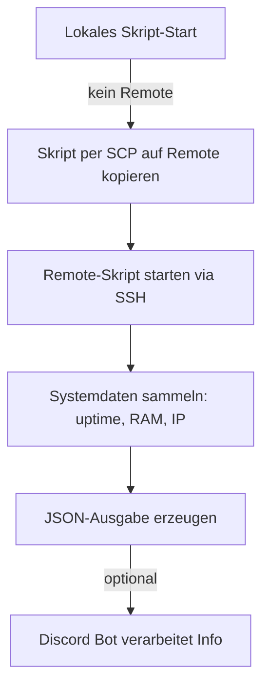
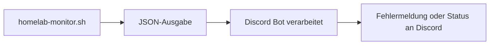

# Homelab Monitor

> ✅ TODO (nach Anonymisierung der zentralen Skripte und des Discord Bots):
>
> - [ ] `check_and_reboot.sh` und `check_ct_vm_memory.sh` verlinken + Abschnitt ⚙️ *Trigger durch zentrale Cronjobs* anpassen
> - [ ] Bot verlinken + Abschnitt 🤖 *Integration mit Discord Bot* neu schreiben lassen

Willkommen im Ordner `custom-scripts/homelab-monitor` deines HomeLab-Repositories. Dieses Setup stellt ein umfassendes, modular aufgebautes Monitoring-Skript bereit, das sowohl manuell als auch automatisch ausgeführt werden kann. Es ist speziell auf dein Homelab-Setup zugeschnitten (Proxmox + NAS + Backup + Discord Bot).

---

## 📊 Ziel des Skripts

Das Skript `homelab-monitor.sh` sammelt systemrelevante Informationen von deinem Proxmox-Host (z. B. Uptime, Load, RAM, IP, Temperatur, Logins, laufende Backups etc.) und stellt sie in einer JSON-Struktur bereit. Es ist so konzipiert, dass es entweder lokal oder remote ausgeführt werden kann.

---

## 📂 Ordnerinhalt

```bash
custom-scripts/homelab-monitor/
├── .env.example            # Beispiel-Konfig für Umgebungsvariablen
├── homelab-monitor.cfg     # (Optional) Zusatzkonfiguration
└── homelab-monitor.sh      # Hauptskript zum Monitoring
```

Auf dem Container **CT100 (Debian)** auf deinem **NAB6 Proxmox-Host** liegen alle produktiven Dateien unter:
```bash
/root/homelab-monitor.sh
/root/homelab-monitor.cfg
/root/homelab-monitor.env
```

---

## 🔎 Funktionsweise (mit Diagramm)



---

## 🛠️ Voraussetzungen

- Proxmox-Host mit SSH-Zugriff
- SSH-Key-Zugriff ohne Passwort (empfohlen)
- installierte Tools: `curl`, `jq`, `ping`, `df`, `journalctl`, `sensors` (optional)
- ein funktionierendes Backupskript wie `ds920_backup.sh`
- ein Discord Bot (optional), der JSON auswertet oder weiterleitet

---

## 📃 Vorbereitung & Einrichtung

1. **Repo klonen (falls nicht geschehen):**
   ```bash
   git clone https://github.com/GSB-Deleven/HomeLab.git
   cd HomeLab/custom-scripts/homelab-monitor
   ```

2. **Konfigurationsdatei anlegen:**
   ```bash
   cp .env.example .env
   nano .env
   ```
   Trage deine echten Werte ein:
   ```env
   REMOTE_HOST=192.168.1.11
   SSH_USER=root
   REMOTE_SCRIPT_PATH=/root/homelab-monitor.sh
   PUBLIC_IP_URL=https://ifconfig.me
   BACKUP_SCRIPT_NAME=ds920_backup.sh
   ```

3. **Skript testen (manuell):**
   ```bash
   bash homelab-monitor.sh --manual
   ```
   Ausgabe erfolgt als JSON im Terminal.

---

## 💾 Integration mit Backup-Skript

Wenn das DS920+-Backup per Skript `ds920_backup.sh` läuft, erkennt das Monitoring-Skript automatisch, ob dieses aktuell aktiv ist, und zeigt:
- 🟢 Läuft seit: ...
- 🔴 Kein laufendes Backup.

Es wird dabei nur geprüft, ob ein Prozess mit diesem Namen aktiv ist (`pgrep -f`).

---

## 🤖 Integration mit Discord Bot

Das JSON-Output kann in deinem Discord Bot verwendet werden (z. B. durch Slash-Command `/status`).



### Beispiel:
```json
{
  "uptime": "up 5 days",
  "ram": "2310 MB / 7896 MB",
  "backup": "🟢 Läuft seit: Mon Apr 8 01:00:04"
}
```

---

## ⚙️ Trigger durch zentrale Cronjobs

Das Skript **wird nicht per Cron auf dem CT100 ausgeführt**. Stattdessen wird es durch zentrale Skripte auf dem NAB6 per Cron getriggert:

- `check_and_reboot.sh`
- `check_ct_vm_memory.sh`

Diese Skripte rufen regelmäßig per SSH das Monitoring auf dem CT100 ab. Ein separater Ordner im Repo für diese beiden Skripte ist geplant.

---

## ⚖️ Sicherheits-Hinweise

- Die `.env`-Datei **niemals committen**! Sie enthält sensible Infos.
- Im Repo ist `.env.example` enthalten. Diese kannst du gefahrlos teilen.
- Deine `.env` steht in der `.gitignore`:
  ```bash
  echo "*.env" >> .gitignore
  ```

---

## 🧠 Tipps

- Die Datei `homelab-monitor.cfg` kann für zukünftige Erweiterungen genutzt werden (z. B. zusätzliche Parameter oder Filter).
- Das Skript kann per Discord Slash Command oder direkt via SSH/Terminal getriggert werden.

---

## 🚀 Nächste Schritte

- [ ] Erweiterung für PBS-Status
- [ ] VS Code Remote-Erkennung als Option
- [ ] Host-Summary für alle Cluster-Knoten
- [ ] Discord Button für manuelles Triggern

---

Fragen, Feedback oder Ideen? 
**Meld dich gerne im Discord oder direkt über das Repo!**
