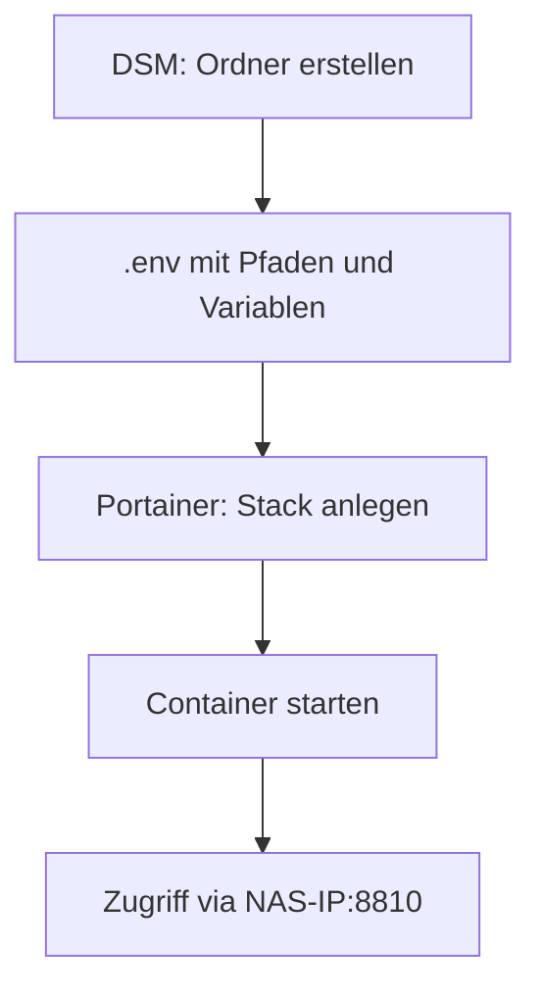

# 📄 Paperless-NGX auf Synology DS920+ via Portainer (Docker)

## 📌 Ziel

> [!NOTE]
> Diese Anleitung ist speziell für den Betrieb von Paperless-NGX auf einer Synology NAS mit Portainer optimiert – ohne Proxmox, LXC oder manuelle Docker-CLI.

Diese Anleitung beschreibt die Installation von **Paperless-NGX** direkt über **Portainer** auf deiner **Synology DS920+**, ohne Proxmox oder LXC. Die Daten werden in einem dedizierten Verzeichnis gespeichert und der Stack wird über das Portainer Webinterface deployed.

---

## 📁 Ordnerstruktur vorbereiten

> [!TIP]
> Erstelle die Verzeichnisse direkt über DSM oder SSH – die Pfade müssen exakt mit dem `.env`- und Compose-Setup übereinstimmen.

Erstelle folgende Verzeichnisse in DSM (File Station oder SSH):

```
/volume1/docker/paperless-ngx/data
/volume1/docker/paperless-ngx/media
/volume1/docker/paperless-ngx/export
/volume1/docker/paperless-ngx/consume
/volume1/docker/paperless-ngx/redisdata
```

---

## ⚙️ .env-Datei erstellen

> [!IMPORTANT]
> Die `.env`-Datei ist zentral für deine Konfiguration – alle Variablen wie `UID`, `GID`, OCR-Sprache und Hostnamen werden hier gesetzt.

Lege in `/volume1/docker/paperless-ngx/` eine `.env` Datei mit folgendem Inhalt an:

```ini
###############################################
# Paperless-ngx .env Beispielkonfiguration
# für dein Synology-Docker-Setup mit Cloudflare
###############################################

# ⚠️ Wichtig: Hier trägst du alle Domains/IPs ein, von denen Paperless erreichbar ist.
PAPERLESS_ALLOWED_HOSTS=paperless.yourdomain.net,192.168.1.XXX,localhost

# ✅ Erlaubte Ursprünge für sichere Formulareingaben (z.B. Login) – HTTPS-Domain notwendig!
PAPERLESS_CSRF_TRUSTED_ORIGINS=https://paperless.yourdomain.net

# 🔗 Redis-URL (Broker für Hintergrundjobs). Bei Docker immer "broker" verwenden.
PAPERLESS_REDIS=redis://broker:6379

# 👤 Admin-Zugang – nur beim ersten Start wichtig!
PAPERLESS_ADMIN_USER=admin
PAPERLESS_ADMIN_PASSWORD=you_admin_password

# 🔐 Geheimer Schlüssel für Django (mind. 50 zufällige Zeichen, z. B. mit `openssl rand -hex 32`)
PAPERLESS_SECRET_KEY=your_secret_key

# 🌍 OCR-Erkennungssprachen – mehrere mit `+` trennen, z.B. Deutsch + Englisch
PAPERLESS_OCR_LANGUAGE=deu+eng

# ♻️ Duplikate beim Einlesen automatisch verwerfen (gleiches Dokument, gleiche Prüfsumme)
PAPERLESS_CONSUMER_DELETE_DUPLICATES=true

# 📷 Unterstützt Barcode-Erkennung beim Einlesen (z. B. für automatische Zuordnung)
PAPERLESS_CONSUMER_ENABLE_BARCODES=true

# 📄 Aktiviert Tika (PDF-Analyse)
PAPERLESS_TIKA_ENABLED=1

# 📤 Gotenberg-Endpoint zum Umwandeln von .doc/.html etc. in PDFs
PAPERLESS_TIKA_GOTENBERG_ENDPOINT=http://gotenberg:3000

# 🧠 Tika-Endpunkt zur Dokumenten-Analyse (z. B. für automatische Klassifizierung)
PAPERLESS_TIKA_ENDPOINT=http://tika:9998

# 👥 Benutzerrechte: UID und GID müssen zu deinem NAS-Benutzer passen!
USERMAP_UID=1000 # Synology-NAS-Benutzer kann auch 1026 oder was auch immer sein
USERMAP_GID=100 # Synology-NAS-Gruppe

# 📁 Basisverzeichnis für Volumes (z. B. consume, media etc.)
DATA_DIR=/volume1/docker/paperless-ngx # Hier den Pfad zu deinem Paperless-Volume anpassen!
```

> 📌 `UID` und `GID` kannst du mit `id deinBenutzername` im DSM-Terminal herausfinden.

---

## 🐳 Docker Compose (für Portainer)

> [!TIP]
> Du kannst die `docker-compose.yml` auch im Webeditor direkt in Portainer einfügen – achte auf korrekte Einrückung und Zeilenumbrüche.

Erstelle eine neue Stack-Datei (`docker-compose.yml`) oder verwende den "Web editor" in Portainer:

```yaml
vversion: "3.4"

services:
  broker:
    image: redis:7
    container_name: paperless-ngx-broker
    restart: unless-stopped
    volumes:
      - ${DATA_DIR}/redisdata:/data

  webserver:
    image: ghcr.io/paperless-ngx/paperless-ngx:latest
    container_name: paperless-ngx-webserver
    restart: unless-stopped
    depends_on:
      - broker
    ports:
      - 8810:8000
    volumes:
      - ${DATA_DIR}/data:/usr/src/paperless/data
      - ${DATA_DIR}/media:/usr/src/paperless/media
      - ${DATA_DIR}/export:/usr/src/paperless/export
      - ${DATA_DIR}/consume:/usr/src/paperless/consume
    environment:
      PAPERLESS_REDIS: ${PAPERLESS_REDIS}
      PAPERLESS_ALLOWED_HOSTS: ${PAPERLESS_ALLOWED_HOSTS}
      PAPERLESS_CSRF_TRUSTED_ORIGINS: ${PAPERLESS_CSRF_TRUSTED_ORIGINS}
      PAPERLESS_SECRET_KEY: ${PAPERLESS_SECRET_KEY}
      PAPERLESS_ADMIN_USER: ${PAPERLESS_ADMIN_USER}
      PAPERLESS_ADMIN_PASSWORD: ${PAPERLESS_ADMIN_PASSWORD}
      PAPERLESS_OCR_LANGUAGE: ${PAPERLESS_OCR_LANGUAGE}
      PAPERLESS_CONSUMER_DELETE_DUPLICATES: ${PAPERLESS_CONSUMER_DELETE_DUPLICATES}
      PAPERLESS_CONSUMER_ENABLE_BARCODES: ${PAPERLESS_CONSUMER_ENABLE_BARCODES}
      PAPERLESS_TIKA_ENABLED: ${PAPERLESS_TIKA_ENABLED}
      PAPERLESS_TIKA_GOTENBERG_ENDPOINT: ${PAPERLESS_TIKA_GOTENBERG_ENDPOINT}
      PAPERLESS_TIKA_ENDPOINT: ${PAPERLESS_TIKA_ENDPOINT}
      USERMAP_UID: ${USERMAP_UID}
      USERMAP_GID: ${USERMAP_GID}

  gotenberg:
    image: gotenberg/gotenberg:8
    container_name: paperless-ngx-gotenberg
    restart: unless-stopped
    command:
      - "gotenberg"
      - "--chromium-disable-javascript=true"
      - "--chromium-allow-list=file:///tmp/.*"

  tika:
    image: ghcr.io/paperless-ngx/tika:latest
    container_name: paperless-ngx-tika
    restart: unless-stopped
```

---

## 🚀 Stack in Portainer deployen

1. Öffne Portainer im Browser
2. Gehe zu **Stacks** → **Add Stack**
3. Gib einen Namen ein, z. B. `paperless-ngx`
4. Füge den obigen Compose-Code ein
5. Aktiviere die `.env` Datei (`Use .env file`)
6. Wähle den Pfad: `/volume1/docker/paperless-ngx/.env`
7. Klicke auf **"Deploy the stack"**

> [!WARNING]
> Stelle sicher, dass alle Volumes korrekt angelegt sind und die `.env`-Datei am richtigen Ort liegt – sonst schlägt der Stack-Start fehl.

---

## 🌐 Zugriff

- Webinterface: [http://NAS-IP:8810](http://NAS-IP:8810)
- Optional: via Cloudflare Tunnel (z. B. `https://paperless.yourdomain.net`)

---

## 🔁 Reimport von Dokumenten

Falls du nach einem Datenbankreset alte Dokumente neu einlesen willst:

```bash
docker exec -it paperless-ngx-webserver document_importer
```

---

## ❌ Datenbank beschädigt?

> [!CAUTION]
> Durch das Löschen oder Umbenennen der `db.sqlite3` gehen alle bisherigen Metadaten verloren – nutze diese Option nur bei echtem Datenbankfehler.

1. Stoppe den Stack in Portainer
2. Benenne `db.sqlite3` um:

```bash
mv /volume1/docker/paperless-ngx/data/db.sqlite3 /volume1/docker/paperless-ngx/data/db.sqlite3.bak
```

3. Starte den Stack neu → Die Datenbank wird neu erstellt.

---

## ✅ Fertig! Paperless-NGX läuft jetzt auf deiner Synology NAS in Portainer.


